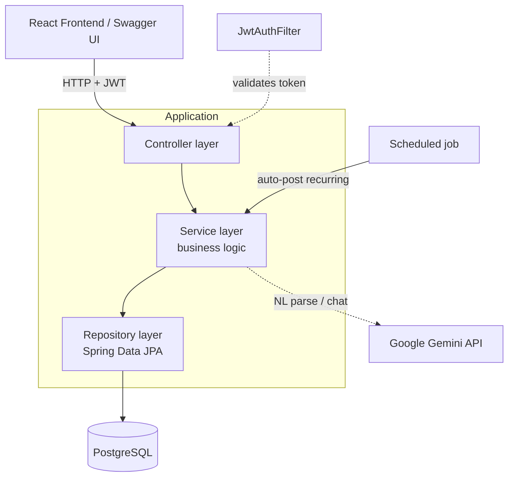
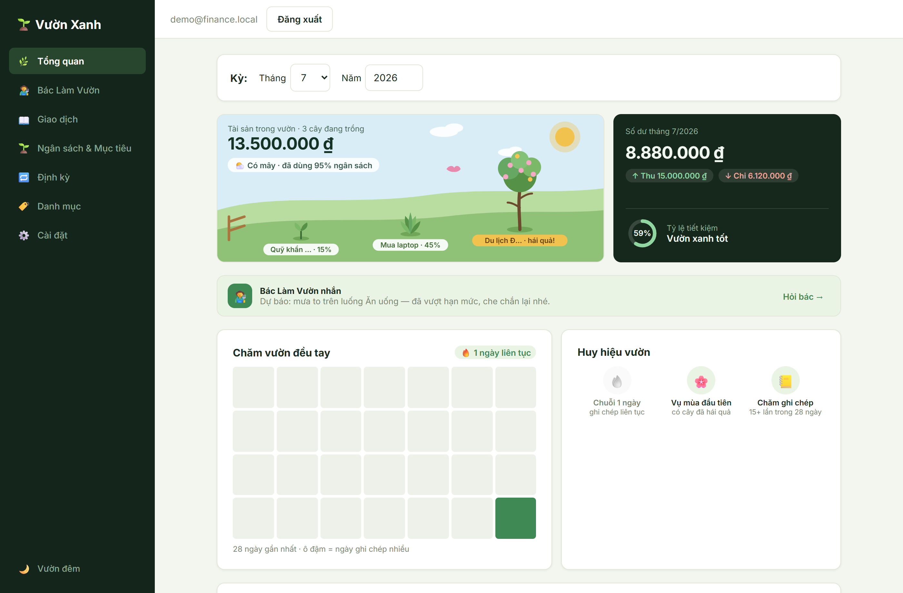

# Personal Finance Management — Full-Stack App

[](https://github.com/tai30052005/personal-finance-api/actions/workflows/ci.yml)

A full-stack personal finance application: a **Spring Boot 3 / Java 17** REST API plus a **React (Vite)** frontend that consumes it. It supports user authentication with JWT, transaction tracking by category, monthly income/expense reporting, savings goals, recurring transactions, an AI assistant, and an automatic budget-overspending alert system. The backend follows a clean layered architecture with input validation, per-user data isolation, and automated tests. The UI ships switchable design concepts — including **"Vườn Xanh"**, a garden metaphor where savings goals grow as plants.

> A complete personal product, built for real everyday use — clean, enterprise-style design across backend and frontend.

**🔗 Live demo:** https://personal-finance-api-taupe.vercel.app — sign in with `demo@finance.local` / `demo1234`.

> Hosted on free tiers (Vercel + Render + Neon). The backend sleeps after inactivity, so the **first request may take ~30–50s** to wake up.

---

## ✨ Key Features

**Core**
- **JWT Authentication** — stateless register/login with BCrypt password hashing and a per-request token filter.
- **Per-user data isolation** — every query is scoped to the authenticated user; one user can never read or modify another user's data.
- **Transactions & categories** — full CRUD with month / keyword / amount filtering and CSV export.
- **Monthly & yearly reports** — income / expense / balance with a per-category breakdown (SQL aggregation), plus month-over-month insights.
- **Budget over-spending alerts** — set a monthly limit per expense category and get an `isOverBudget` flag plus the overspent amount.

**Beyond CRUD**
- **Savings goals** — set a target amount, contribute over time, track progress %.
- **Recurring transactions** — monthly templates auto-posted by a scheduled job (`@Scheduled`), or run on demand.
- **AI assistant (Google Gemini)** — natural-language transaction entry (e.g. "cà phê 40k") and a chat advisor that reasons over your real monthly data.
- **Switchable UI concepts** — a two-axis theming system; ships **"Vườn Xanh"**, a garden metaphor where savings goals grow as procedurally-drawn plants, with a day / night mode and a care-streak heatmap.

**Engineering**
- **Layered architecture** — Controller → Service → Repository, with DTOs separating the API from entities.
- **Money done right** — `BigDecimal` for all monetary values (never `double`/`float`) to avoid rounding errors.
- **Schema migrations** — Flyway-versioned SQL (V1–V4).
- **Input validation** — Jakarta Bean Validation with a centralized exception handler returning consistent JSON errors.
- **Automated tests + CI** — JUnit 5 on an H2 in-memory database; GitHub Actions runs the full suite and the frontend build on every push.
- **Dockerized** — the whole stack (API + PostgreSQL + frontend) runs with a single command, with auto-generated Swagger UI.

---

## 🛠 Tech Stack

| Layer | Technology |
|---|---|
| Language | Java 17 |
| Backend | Spring Boot 3.3 (Web, Data JPA, Security, Validation) |
| Frontend | React 19 + Vite, React Router, Axios |
| Database | PostgreSQL 16 (H2 in-memory for tests) |
| Migrations | Flyway |
| Auth | Spring Security + JWT (jjwt) |
| Scheduling | Spring `@Scheduled` (recurring transactions) |
| AI | Google Gemini API (natural-language entry + chat advisor) |
| API docs | springdoc-openapi (Swagger UI) |
| Build | Maven (backend), npm (frontend) |
| Testing | JUnit 5, Spring Boot Test, MockMvc |
| CI | GitHub Actions (tests + frontend build) |
| Packaging | Docker + Docker Compose |

---

## 🏛 Architecture



A request carrying `Authorization: Bearer <token>` passes through `JwtAuthFilter`, which validates the token and loads the user into the security context. Controllers stay thin; business logic lives in services; data access is isolated in repositories.

---

## 🚀 Getting Started (Docker — one command)

**Prerequisites:** [Docker Desktop](https://www.docker.com/products/docker-desktop/) installed and running.

```bash
docker compose up --build
```

This brings up **three containers**:
1. PostgreSQL.
2. The Spring Boot API (Flyway applies the schema migration on startup) — port `8080`.
3. The React frontend served by Nginx — port `3000`.

Once started, open:

- **App (React UI):** http://localhost:3000
- **Swagger UI:** http://localhost:8080/swagger-ui.html
- **Health check:** http://localhost:8080/api/health

In the Docker setup, Nginx serves the built frontend and proxies `/api` to the backend, so the UI and API share one origin (no CORS needed).

To stop: `docker compose down` (add `-v` to also remove the database volume).

---

## 💻 Frontend (React) — dev mode

The frontend also runs standalone with hot-reload (separate from Docker):

```bash
cd frontend
npm install
npm run dev
```

Open **http://localhost:5173**. The Vite dev server calls the backend on port 8080 (CORS enabled for this origin). JWT is stored in `localStorage` and attached to every request via an Axios interceptor.

**Pages:** Login / Register · Overview (garden hero, monthly report, budget status with over-budget alerts, care-streak heatmap) · Transactions (add / edit / delete, month & keyword filters, AI quick-entry, CSV export) · Budgets & Goals · Recurring · Categories · AI Assistant · Settings (switch UI concept and light / dark mode).

---

## 🔑 Using the API

**1. Register** (returns a JWT token):
```bash
curl -X POST http://localhost:8080/api/auth/register \
  -H "Content-Type: application/json" \
  -d '{"email":"demo@finance.local","password":"demo1234"}'
```

**2. Log in** (also returns a token):
```bash
curl -X POST http://localhost:8080/api/auth/login \
  -H "Content-Type: application/json" \
  -d '{"email":"demo@finance.local","password":"demo1234"}'
```

**3. Call a protected endpoint** with the token:
```bash
curl http://localhost:8080/api/transactions \
  -H "Authorization: Bearer <YOUR_TOKEN>"
```

> In Swagger UI you can click **Authorize**, paste the token, and try every endpoint from the browser.

---

## 📚 API Endpoints

| Method | Path | Description | Auth |
|---|---|---|:---:|
| POST | `/api/auth/register` | Register a new user, returns JWT | ❌ |
| POST | `/api/auth/login` | Log in, returns JWT | ❌ |
| GET | `/api/health` | Health check | ❌ |
| GET | `/api/me` | Current authenticated user | ✅ |
| GET · POST · PUT · DELETE | `/api/categories`, `/api/categories/{id}` | Category CRUD | ✅ |
| GET · POST · PUT · DELETE | `/api/transactions`, `/api/transactions/{id}` | Transaction CRUD (filter `?month=&year=&keyword=&minAmount=&maxAmount=`) | ✅ |
| POST | `/api/transactions/parse` | AI: parse natural language into transaction(s) | ✅ |
| GET | `/api/transactions/parse-enabled` | Whether the AI parse feature is configured | ✅ |
| GET | `/api/transactions/export` | Export transactions as CSV | ✅ |
| GET | `/api/reports/monthly?month=&year=` | Monthly income / expense / balance report | ✅ |
| GET | `/api/reports/yearly?year=` | Yearly report | ✅ |
| GET | `/api/reports/insights?month=&year=` | Month-over-month insights | ✅ |
| GET | `/api/reports/activity?days=` | Daily logging activity (care-streak heatmap) | ✅ |
| POST | `/api/budgets` | Set a monthly budget for a category | ✅ |
| GET | `/api/budgets/status?month=&year=` | Budget status + over-budget alerts | ✅ |
| GET · POST · PUT · DELETE | `/api/recurring`, `/api/recurring/{id}` | Recurring-transaction CRUD | ✅ |
| POST | `/api/recurring/{id}/run` | Post a recurring transaction now | ✅ |
| GET · POST · PUT · DELETE | `/api/goals`, `/api/goals/{id}` | Savings-goal CRUD | ✅ |
| POST | `/api/goals/{id}/contribute` | Contribute to a savings goal | ✅ |
| POST | `/api/ai/chat` | AI advisor chat over the current period's data | ✅ |

> Full request/response schemas for all ~33 endpoints are browsable in Swagger UI.

---

## 🖼 Screenshots

The **"Vườn Xanh"** concept — savings goals grow as plants, budget health shows as weather, and a daily care-streak heatmap tracks your logging habit:



Interactive Swagger UI showing the REST endpoints:


---

## 🧪 Running Tests

Tests run on an H2 in-memory database — no PostgreSQL required:

```bash
mvn test
```

The suite (18 tests) covers: registration/login (and wrong-password `401`), transaction validation (`amount <= 0` → `400`), per-user data isolation across transactions / goals / recurring, the budget over-spending alert, savings-goal progress & completion, recurring "run now", and the activity endpoint. The same suite runs in CI on every push.

---

## 📁 Project Structure

```
src/main/java/com/example/financeapi/
├── config/        # SecurityConfig, OpenApiConfig
├── controller/    # REST endpoints
├── service/       # Business logic
├── repository/    # Spring Data JPA repositories
├── entity/        # JPA entities
├── dto/           # Request/response objects
├── security/      # JwtUtil, JwtAuthFilter, UserDetailsService
├── scheduler/     # @Scheduled job posting recurring transactions
├── ai/            # Google Gemini client (NL parse + chat)
└── exception/     # GlobalExceptionHandler
src/main/resources/
├── application.yml
└── db/migration/  # Flyway scripts (V1__init … V4__transaction_receipt)
src/test/java/...  # JUnit 5 tests
.github/workflows/ci.yml   # GitHub Actions: backend tests + frontend build
```

---

## 🔭 Possible Improvements

- Refresh tokens and token revocation.
- Pagination for transaction listings.
- Role-based access (admin vs. user).
- Test coverage reporting (JaCoCo) surfaced in CI.

---

## 👤 Author

**Võ Minh Tài** — [GitHub](https://github.com/tai30052005)
