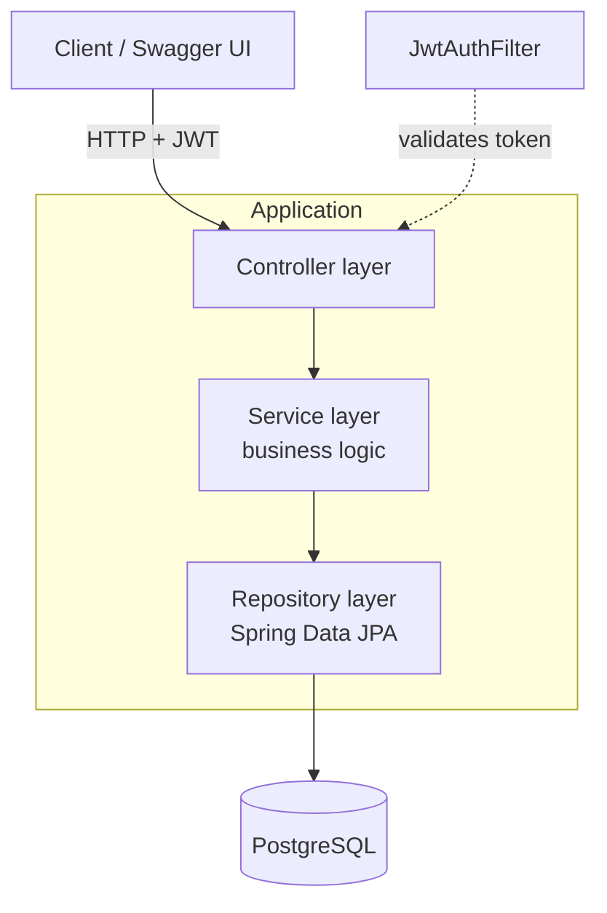
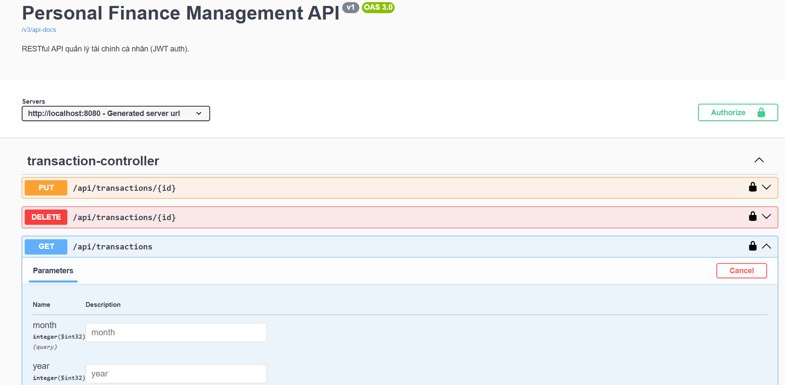

# Personal Finance Management API

A RESTful backend service for personal finance management, built with **Java 17** and **Spring Boot 3**. It supports user authentication with JWT, transaction tracking by category, monthly income/expense reporting, and an automatic budget-overspending alert system. The project follows a clean layered architecture with input validation, per-user data isolation, and automated tests.

> Personal project for a Software Engineer Intern application — focused on clean, enterprise-style backend design.

---

## ✨ Key Features

- **JWT Authentication** — stateless register/login with BCrypt password hashing and a per-request token filter.
- **Per-user data isolation** — every query is scoped to the authenticated user; one user can never read or modify another user's data.
- **Budget over-spending alerts** — set a monthly limit per expense category and get an `isOverBudget` flag plus the overspent amount.
- **Monthly reports** — total income / expense / balance for a month, with a per-category breakdown (SQL aggregation).
- **Layered architecture** — Controller → Service → Repository, with DTOs separating the API from entities.
- **Money done right** — `BigDecimal` for all monetary values (never `double`/`float`) to avoid rounding errors.
- **Input validation** — Jakarta Bean Validation with a centralized exception handler returning consistent JSON errors.
- **Automated tests** — JUnit 5 + MockMvc running on an H2 in-memory database.
- **Dockerized** — the whole stack (API + PostgreSQL) runs with a single command.
- **Auto-generated API docs** — interactive Swagger UI via springdoc-openapi.

---

## 🛠 Tech Stack

| Layer | Technology |
|---|---|
| Language | Java 17 |
| Framework | Spring Boot 3.3 (Web, Data JPA, Security, Validation) |
| Database | PostgreSQL 16 (H2 in-memory for tests) |
| Migrations | Flyway |
| Auth | Spring Security + JWT (jjwt) |
| API docs | springdoc-openapi (Swagger UI) |
| Build | Maven |
| Testing | JUnit 5, Spring Boot Test, MockMvc |
| Packaging | Docker + Docker Compose |

---

## 🏛 Architecture



A request carrying `Authorization: Bearer <token>` passes through `JwtAuthFilter`, which validates the token and loads the user into the security context. Controllers stay thin; business logic lives in services; data access is isolated in repositories.

---

## 🚀 Getting Started (Docker — one command)

**Prerequisites:** [Docker Desktop](https://www.docker.com/products/docker-desktop/) installed and running.

```bash
docker compose up --build
```

This will:
1. Start a PostgreSQL container.
2. Build and run the Spring Boot app (Flyway applies the schema migration on startup).
3. Expose the API on port `8080`.

Once started, open:

- **Swagger UI:** http://localhost:8080/swagger-ui.html
- **Health check:** http://localhost:8080/api/health

To stop: `docker compose down` (add `-v` to also remove the database volume).

---

## 🔑 Using the API

**1. Register** (returns a JWT token):
```bash
curl -X POST http://localhost:8080/api/auth/register \
  -H "Content-Type: application/json" \
  -d '{"email":"demo@finance.local","password":"demo1234"}'
```

**2. Log in** (also returns a token):
```bash
curl -X POST http://localhost:8080/api/auth/login \
  -H "Content-Type: application/json" \
  -d '{"email":"demo@finance.local","password":"demo1234"}'
```

**3. Call a protected endpoint** with the token:
```bash
curl http://localhost:8080/api/transactions \
  -H "Authorization: Bearer <YOUR_TOKEN>"
```

> In Swagger UI you can click **Authorize**, paste the token, and try every endpoint from the browser.

---

## 📚 API Endpoints

| Method | Path | Description | Auth |
|---|---|---|:---:|
| POST | `/api/auth/register` | Register a new user | ❌ |
| POST | `/api/auth/login` | Log in, returns JWT | ❌ |
| GET | `/api/me` | Current authenticated user | ✅ |
| GET | `/api/categories` | List categories | ✅ |
| POST | `/api/categories` | Create a category | ✅ |
| PUT | `/api/categories/{id}` | Update a category | ✅ |
| DELETE | `/api/categories/{id}` | Delete a category | ✅ |
| GET | `/api/transactions` | List transactions (filter `?month=&year=&categoryId=`) | ✅ |
| POST | `/api/transactions` | Create a transaction | ✅ |
| PUT | `/api/transactions/{id}` | Update a transaction | ✅ |
| DELETE | `/api/transactions/{id}` | Delete a transaction | ✅ |
| GET | `/api/reports/monthly?month=&year=` | Monthly income/expense/balance report | ✅ |
| POST | `/api/budgets` | Set a monthly budget for a category | ✅ |
| GET | `/api/budgets/status?month=&year=` | Budget status + over-budget alerts | ✅ |

---

## 🖼 Screenshot

Swagger UI showing the available endpoints:



---

## 🧪 Running Tests

Tests run on an H2 in-memory database — no PostgreSQL required:

```bash
mvn test
```

Coverage includes: registration/login (and wrong-password `401`), transaction validation (`amount <= 0` → `400`), per-user data isolation, and the budget over-spending alert.

---

## 📁 Project Structure

```
src/main/java/com/example/financeapi/
├── config/        # SecurityConfig, OpenApiConfig
├── controller/    # REST endpoints
├── service/       # Business logic
├── repository/    # Spring Data JPA repositories
├── entity/        # JPA entities
├── dto/           # Request/response objects
├── security/      # JwtUtil, JwtAuthFilter, UserDetailsService
└── exception/     # GlobalExceptionHandler
src/main/resources/
├── application.yml
└── db/migration/  # Flyway scripts (V1__init.sql)
src/test/java/...  # JUnit 5 tests
```

---

## 🔭 Possible Improvements

- Refresh tokens and token revocation.
- Pagination for transaction listings.
- Role-based access (admin vs. user).
- CI pipeline (GitHub Actions) running `mvn test` on each push.

---

## 👤 Author

**Võ Minh Tài** — [GitHub](https://github.com/tai30052005)
